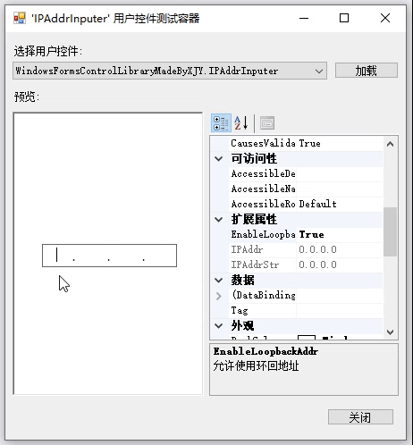
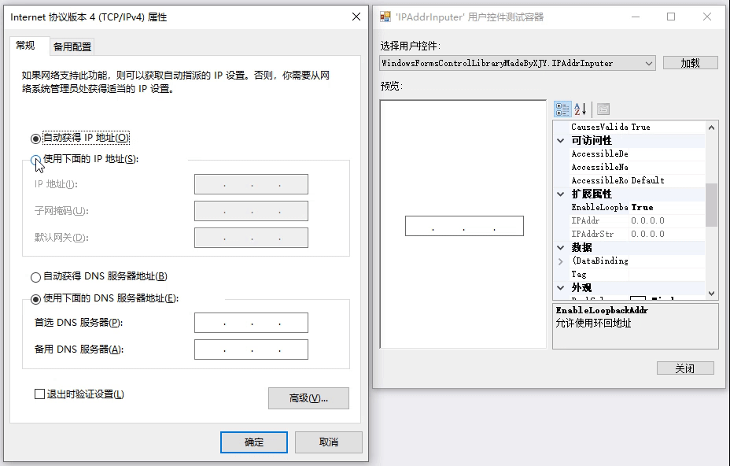
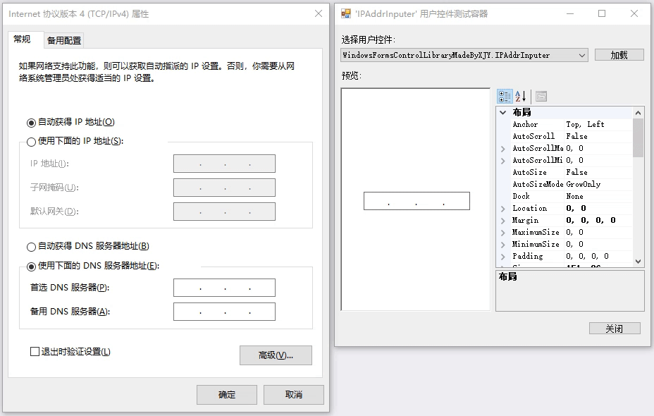
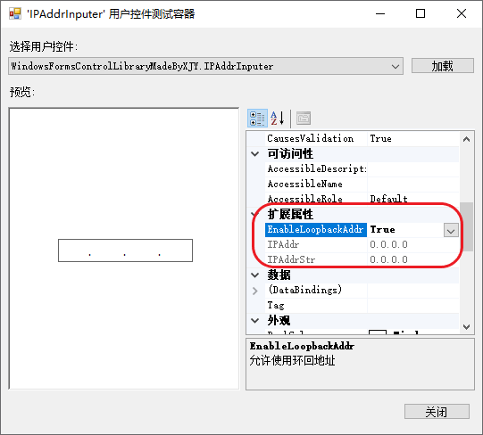
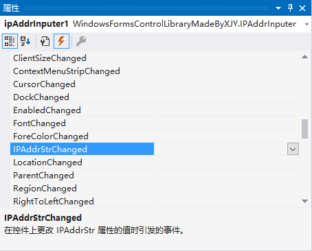

# 1、效果演示

# 2、仿 Windows 原生

仿 Windows 原生 IPV4 地址输入框： 

# 3、使用方法

与 Windows 原生 IPV4 地址输入框使用方法相同。

> 📌 **支持复制粘贴**
>
> 与 Windows 原生 IPV4 地址输入框一致：在控件拥有焦点且光标未选定任何文本的情况下，可使用快捷键 `Ctrl+C` 与 `Ctrl+V` 复制和粘贴整段 IP 地址。 

> 📌 **扩展属性**
>
> `IPAddrInputer` 提供了一些扩展属性：
> * **EnableLoopbackAddr**：获取或设置以允许以 `127` 开头的 IP 地址；
> * **IPAddr**：获取 IP 地址（[IPAddress](https://learn.microsoft.com/zh-cn/dotnet/api/system.net.ipaddress?view=net-7.0) 对象）；
> * **IPAddrStr**：获取 IP 地址字符串（若要设置该属性，请调用 `IPAddrInputer.SetIPAddrStr()` 方法）； 

> 📌 **扩展事件**
>
> `IPAddrInputer` 提供了一些扩展事件：
> * **IPAddrStrChanged**：在 IPAddrStr 属性更改后发生；
>   > 请注意，如果您是通过粘贴整段 IP 地址字符串到控件，则会触发四次 IPAddrStrChanged 事件。
> 

# 4、实现思路

1. 控件组成：控件核心部分由 4 个 [TextBox](https://learn.microsoft.com/zh-cn/dotnet/desktop/winforms/controls/textbox-control-windows-forms?view=netframeworkdesktop-4.8) 控件和 3 个 [Label](https://learn.microsoft.com/zh-cn/dotnet/desktop/winforms/controls/label-control-windows-forms?view=netframeworkdesktop-4.8) 控件组成。
2. 每一个 TextBox 都订阅了其 4 个事件：[KeyDown](https://learn.microsoft.com/zh-cn/dotnet/api/system.windows.forms.control.keydown?view=netframework-4.8), [KeyPress](https://learn.microsoft.com/zh-cn/dotnet/api/system.windows.forms.control.keypress?view=netframework-4.8), [TextChanged](https://learn.microsoft.com/zh-cn/dotnet/api/system.windows.forms.control.textchanged?view=netframework-4.8), [Validating](https://learn.microsoft.com/zh-cn/dotnet/api/system.windows.forms.control.validating?view=netframework-4.8)，以实现用户输入的逻辑控制（具体实现可参考[代码注释](https://github.com/YMGogre/WindowsFormsControlLibraryMadeByXJY/blob/master/IPAddrInputer/IPAddrInputer.cs)）。
3. 重写 [ProcessCmdKey()](https://learn.microsoft.com/zh-cn/dotnet/api/system.windows.forms.control.processcmdkey?view=netframework-4.8) 方法以处理 `Ctrl+C` 和 `Ctrl+V` 命令，实现在任意字段内可直接复制或粘贴 IP 地址字符串。

# 5、[完整源码](IPAddrInputer.cs)