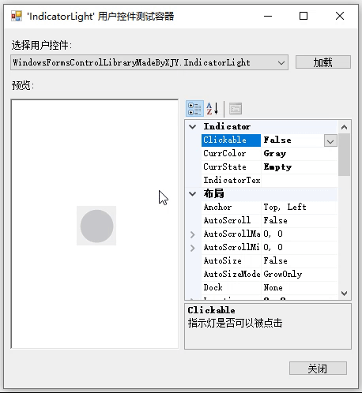
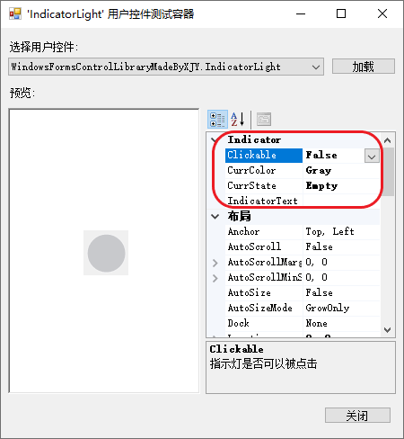
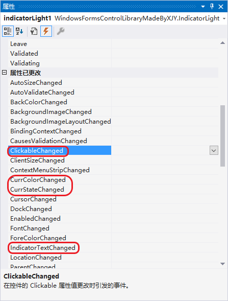

# 1、效果演示

<div align="center"></div>

# 2、使用方法

> 📌 <font color="#FF6699">**扩展属性**</font>
>
> `IndicatorLight` 提供了一些扩展属性：
> * **Clickable**：获取或设置指示灯是否可以被点击；
>   > 请注意，该属性并不会阻止点击事件的发出，但您可以在点击事件处理函数中判断该属性以决定是否要处理点击事件
> * **CurrColor**：获取或设置指示灯显示的颜色。获取该属性将会返回枚举值，枚举值定义如下：
>   ```csharp
>   public enum IndicatorColors
>   {
>       /// <summary>灰色</summary>
>       Gray = 0xC8C9CC,
>       /// <summary>蓝色</summary>
>       Blue = 0x409EFF,
>       /// <summary>绿色</summary>
>       Green = 0x67C23A,
>       /// <summary>黄色</summary>
>       Yellow = 0xE6A23C,
>       /// <summary>红色</summary>
>       Red = 0xF56C6C
>   }
>   ```
> * **CurrState**：获取或设置指示灯的状态，每种状态与颜色唯一匹配。获取该属性将会返回枚举值，枚举值[定义如下](https://element.eleme.cn/#/zh-CN/component/color "组件 | Element")：
>   ```csharp
>   public enum IndicatorState
>   {
>       /// <summary>空状态，UI 表现为灰色</summary>
>       Empty = IndicatorColors.Gray,
>       /// <summary>信息状态，UI 表现为蓝色</summary>
>       Info = IndicatorColors.Blue,
>       /// <summary>成功状态，UI 表现为绿色</summary>
>       Success = IndicatorColors.Green,
>       /// <summary>警告状态，UI 表现为黄色</summary>
>       Warn = IndicatorColors.Yellow,
>       /// <summary>错误状态，UI 表现为红色</summary>
>       Error = IndicatorColors.Red,
>   };
>   ```
> * **IndicatorText**：获取或设置指示灯显示的文本；
>
> <div align="center"></div>

> 📌 <font color="#FF6699">**扩展事件**</font>
> 
> `IndicatorLight` 提供了一些扩展事件：
> * 对于上述的扩展属性，都提供了对应的扩展事件；这些扩展事件将在属性的值更改时发生。
>
> <div align="center"></div>

# 3、[完整源码](IndicatorLight.cs)