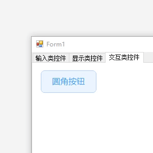
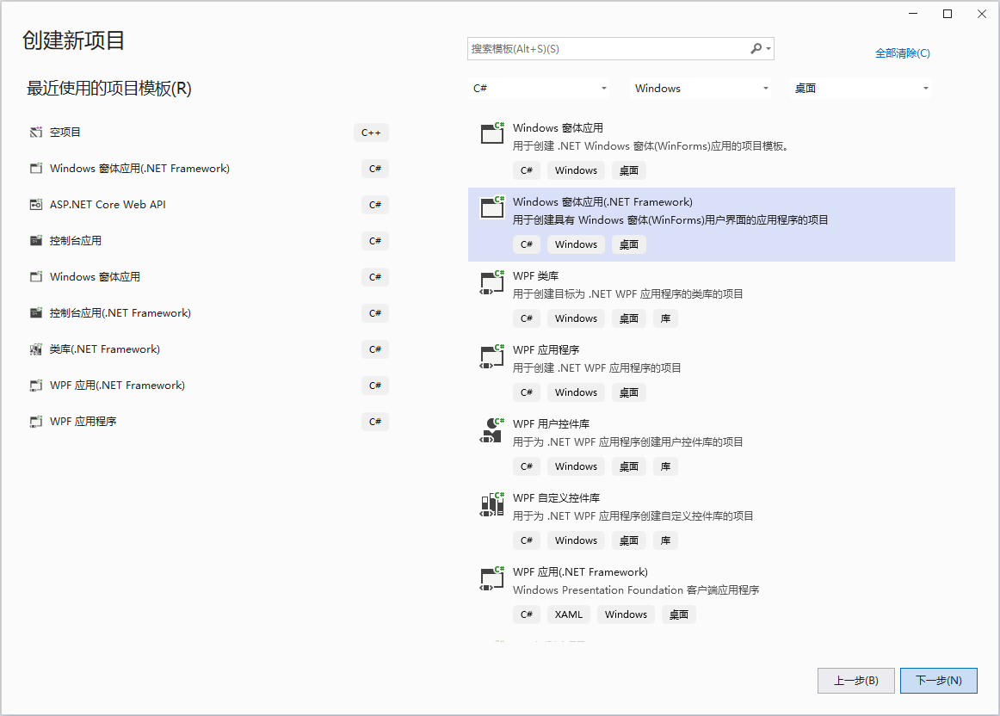
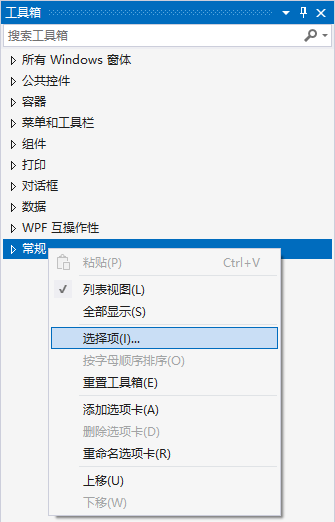
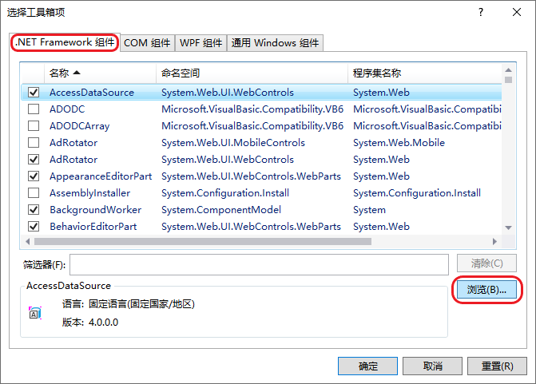
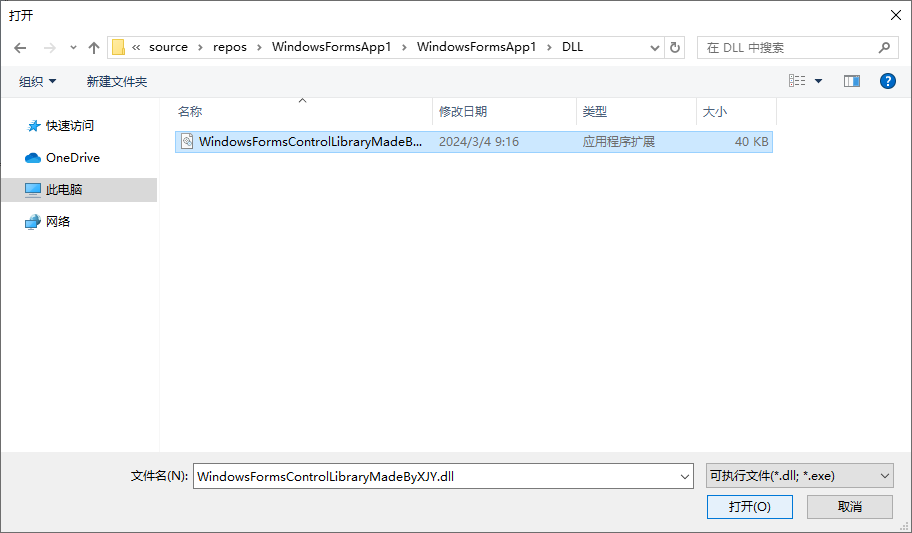
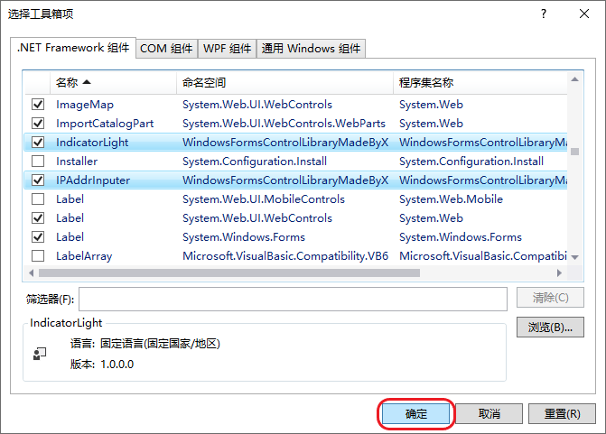

# WindowsFormsControlLibraryMadeByXJY

本仓库是 [.NET Framework](https://dotnet.microsoft.com/zh-cn/learn/dotnet/what-is-dotnet-framework "什么是.NET Framework? 一个软件开发框架") 下 [WinForms](https://learn.microsoft.com/zh-cn/dotnet/desktop/winforms/?view=netframeworkdesktop-4.8 ".NET 的 Windows 窗体相关文档 \| Microsoft Learn") 框架自定义控件仓库。

## 🌐 欢迎访问本仓库 [GitHub Page](https://ymgogre.github.io/WindowsFormsControlLibraryMadeByXJY/)！

## 1、先决条件

* [Visual Studio 2022 版本 17.4 或更高版本](https://visualstudio.microsoft.com/zh-hans/downloads/)
  * 选择 [.NET 桌面开发工作负载](https://learn.microsoft.com/zh-cn/visualstudio/install/modify-visual-studio?view=vs-2022&preserve-view=true#modify-workloads)

* 推荐目标框架 .NET Framework 4.8 或更高版本 

## 2、仓库组成

|控件名称|效果预览|
|:---|:---:|
|[IP 地址输入框控件](./IPAddrInputer/README.md)||
|[开关控件](./Switch/README.md)||
|[水印文本框控件](./WatermarkTextBox/README.md)||
|[选择器控件](./Selector/README.md)||
|[圆角按钮控件](./RoundButton/README.md)||
|[指示灯控件](./IndicatorLight/README.md)||

## 3、使用方法

1. 首先前往本仓库[动态链接库](./DLL)文件夹，下载 `WindowsFormsControlLibraryMadeByXJY.dll` 动态链接库文件。
2. 创建一个新的（或前往已有的） Windows 窗体应用程序（.NET Framework）项目： 
3. 将下载好的 `WindowsFormsControlLibraryMadeByXJY.dll` 动态链接库文件拷贝至您的计算机的任意位置（方便访问到的目录即可）。

    > 推荐将其拷贝至您的目标项目目录下，这样可以保证动态链接库文件会随着您的项目一同迁移。

4. 返回 Visual Studio，在设计页面打开[工具箱](https://learn.microsoft.com/zh-cn/visualstudio/ide/reference/toolbox?view=vs-2022)窗口。选中其中任意一个条目后鼠标右击，点击【选择项】： 
5. 在弹出的对话框内，找到【.NET Framework 组件】选项卡，点击【浏览】： 
6. 找到拷贝的 `WindowsFormsControlLibraryMadeByXJY.dll` 动态链接库文件并点击【打开】： 
7. 可以看到新增的控件都会选中蓝色高亮显示，添加完成后点击右下角【确定】： 
8. 完成后我们就能像普通控件一样在设计页面拖动并使用本仓库的控件啦： 

---

> 如果您想要额外了解如何创建 .NET Framework 下 WinForms 自定义控件库，请参考：
> [在Visual Studio中创建自定义Winform控件库并在其他解决方案中引用](https://blog.csdn.net/YMGogre/article/details/126508042 "【入门级图文教程】在Visual Studio中创建自定义Winform控件库并在其他解决方案中引用 - CSDN 博客")
> 

