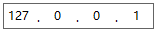
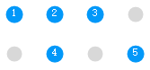

# WindowsFormsControlLibraryMadeByXJY

本网站是 [.NET Framework](https://dotnet.microsoft.com/zh-cn/learn/dotnet/what-is-dotnet-framework "什么是.NET Framework? 一个软件开发框架") 下 [WinForms](https://learn.microsoft.com/zh-cn/dotnet/desktop/winforms/?view=netframeworkdesktop-4.8 ".NET 的 Windows 窗体相关文档 \| Microsoft Learn") 框架[自定义控件仓库](https://github.com/YMGogre/WindowsFormsControlLibraryMadeByXJY)的在线预览网站。

## 1、先决条件

* [Visual Studio 2022 版本 17.4 或更高版本](https://visualstudio.microsoft.com/zh-hans/downloads/)
  * 选择 [.NET 桌面开发工作负载](https://learn.microsoft.com/zh-cn/visualstudio/install/modify-visual-studio?view=vs-2022&preserve-view=true#modify-workloads)

## 2、仓库组成

|控件名称|效果预览|
|:---|:---:|
|[IP 地址输入框控件](./IPAddrInputer/README.md)||
|[开关控件](./Switch/README.md)||
|[水印文本框控件](./WatermarkTextBox/README.md)||
|[选择器控件](./Selector/README.md)||
|[圆角按钮控件](./RoundButton/README.md)|<button class="button">圆角按钮</button>|
|[指示灯控件](./IndicatorLight/README.md)|

|
 

## 3、使用方法

如果您想要了解如何创建 .NET Framework 下 WinForms 自定义控件库或者想了解如何在其他项目中引用本仓库，请参考：
> [在Visual Studio中创建自定义Winform控件库并在其他解决方案中引用](https://blog.csdn.net/YMGogre/article/details/126508042 "【入门级图文教程】在Visual Studio中创建自定义Winform控件库并在其他解决方案中引用 - CSDN 博客")
> 

