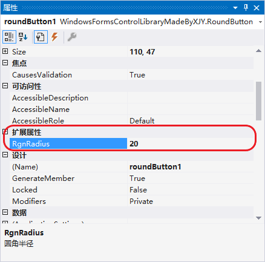

# 1、效果演示

<button class="button">圆角按钮</button>

# 2、使用方法

> 📌 **扩展属性**
>
> `RoundButton` 提供了一些扩展属性：
> * **RgnRadius**：获取或设置圆角半径；
> * **RoundBackColor**：获取或设置圆角按钮背景颜色，默认为浅蓝色；
> * **RoundBorderColor**：获取或设置圆角按钮轮廓颜色，默认为蓝色；
> * **RoundBorderSize**：获取或设置一个值，该值指定圆角按钮周围的边框的大小（以像素为单位），默认为 1；
> * **RoundButtonPressedColor**：获取或设置圆角按钮按下时背景色，默认为深蓝色; 

> 📌 **注意**
>
> 由于 Windows 11 对系统 UI 视觉设计的更改，Win11 默认的按钮样式已经更改为圆角按钮了。而 Winform Button 控件会根据操作系统的主题和样式进行渲染，所以 Winform 的按钮控件在 Win11 上已经默认显示为圆角了。
> > **已经...可以不用再战斗了**😢

# 3、[完整源码](RoundButton.cs)