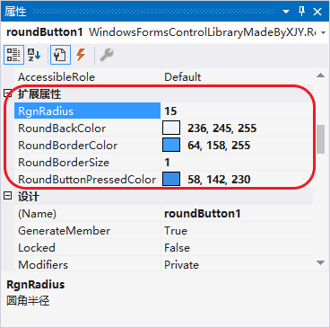

# 1、效果演示

# 2、使用方法

> 📌 **扩展属性**
>
> `RoundButton` 提供了一些扩展属性：
> * **RgnRadius**：获取或设置圆角半径；
>
> 

> 📌 **注意**
>
> 由于 Windows 11 对系统 UI 视觉设计的更改，Win11 默认的按钮样式已经更改为圆角按钮了。而 Winform Button 控件会根据操作系统的主题和样式进行渲染，所以 Winform 的按钮控件在 Win11 上已经默认显示为圆角了。
> > **已经...可以不用再战斗了**😢

# 3、[完整源码](RoundButton.cs)