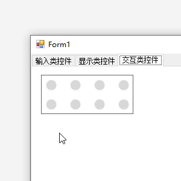
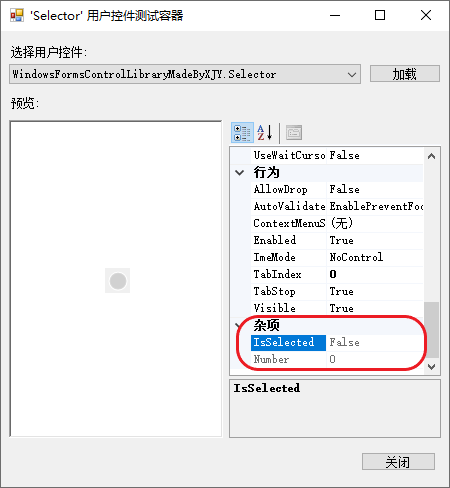

# 1、效果演示

# 2、使用方法

> 📌 **扩展属性**
>
> `Selector` 提供了一些扩展属性：
> * **Number**：获取选中项的编号；
>     > 当控件没有被选中时，该属性的值为 0。
> * **IsSelected**：获取当前的选中状态；
>
> 

> 📌 **成员方法**
>
> `Selector` 提供了一些成员方法：
> * `SelectThis()`：调用该方法以选中当前项；
> * `DeselectThis()`：调用该方法以取消选中当前项；

# 3、[完整源码](Selector.cs)