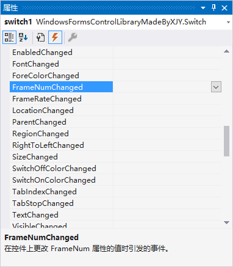

# 1、效果演示

<html><head><link rel="stylesheet" type="text/css" href="./assets/css/Switch.css"></head><body><label class="switch"><input type="checkbox"></label></body></html>

# 2、使用方法

#### 🔔 在设计页面添加该控件后，您可能需要手动设置 `AutoSize` 属性为 `false` 以及 `Text` 属性为空，以达到最佳的视觉效果。

> 📌 **扩展属性**
>
> `Switch` 提供了一些扩展属性：
> * **DisabledSwitchOffColor**：获取或设置 `Control.Enabled` 属性为 `fasle` 并且开关关闭时的背景色；
> * **DisabledSwitchOnColor**：获取或设置 `Control.Enabled` 属性为 `fasle` 并且开关打开时的背景色；
> * **FrameNum**：获取或设置完成过渡动画需要的帧数量（推荐保持默认）；
> * **FrameRate**：获取或设置过渡动画的帧率（推荐保持默认）；
> * **SwitchOffColor**：获取或设置开关关闭时的背景色；
> * **SwitchOnColor**：获取或设置开关打开时的背景色；
>
> 

> 📌 **原生属性**
>
> `Switch` 沿用了一些原生属性：
> * **Checked**：获取或设置开关的 打开/关闭 状态；
> * **Padding**：获取或设置控件的内部间距；
> * **Text**：获取或设置与控件关联的文本；
>   > 通常情况下推荐将 Text 属性设置为空字符串，转而使用一个单独的 [Label](https://learn.microsoft.com/zh-cn/dotnet/desktop/winforms/controls/label-control-windows-forms?view=netframeworkdesktop-4.8) 控件为 Switch 控件提供说明性文字。从而达到最佳的视觉效果。

> 📌 **扩展事件**
> 
> `Switch` 提供了一些扩展事件：
> * **FrameNumChanged**：在 FrameNum 属性更改后发生；
> * **FrameRateChanged**：在 FrameRate 属性更改后发生；
> * **SwitchOffColorChanged**：在 SwitchOffColor 属性更改后发生；
> * **SwitchOnColorChanged**：在 SwitchOnColor 属性更改后发生；
> 
> 

# 3、实现思路

1. Switch 继承自 [CheckBox](https://learn.microsoft.com/zh-cn/dotnet/desktop/winforms/controls/checkbox-control-windows-forms?view=netframeworkdesktop-4.8) 控件以提供开关控件所需的基本功能；
2. 重写基类的 [OnPaint](https://learn.microsoft.com/zh-cn/dotnet/api/system.windows.forms.control.onpaint?view=netframework-4.8.1) 方法为控件添加自定义外观；
3. 使用 [Timer](https://learn.microsoft.com/zh-cn/dotnet/api/system.windows.forms.timer?view=netframework-4.8.1) 实现背景颜色和开关滑块位置的平滑过渡动画；
4. 重写 [OnCheckedChanged](https://learn.microsoft.com/zh-cn/dotnet/api/system.windows.forms.checkbox.oncheckedchanged?view=netframework-4.8.1) 方法以在 Checked 属性更改时播放动画。

# 4、[完整源码](Switch.cs)