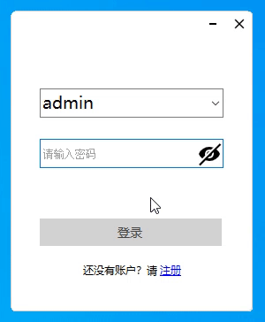
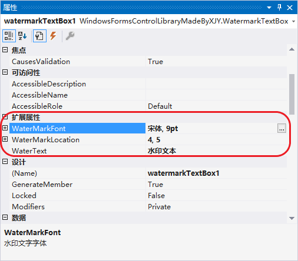

# 1、效果演示

# 2、使用方法

> 📌 **扩展属性**
>
> `WatermarkTextBox` 提供了一些扩展属性：
>
> * **WaterText**：获取或设置水印文字的文本；
> * **WaterMarkFont**：获取或设置水印文字的字体；
> * **WaterMarkLocation**：获取或设置水印文字左上角相对于文本框左上角的坐标；
>
> 

# 3、[完整源码](WatermarkTextBox.cs)